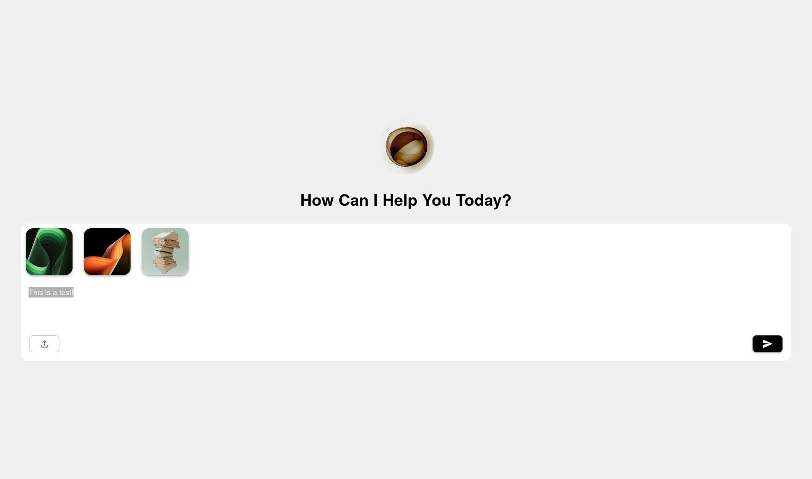

# Text & Image Uploader

## Project Overview

This project implements a robust and user-friendly interface for uploading textual content alongside image attachments. Designed with React and TypeScript, and styled using Material-UI (MUI), it supports both drag-and-drop and traditional file selection workflows. Sent messages are displayed in a scrollable list, with features for selection, bulk actions, and exporting data.

**Live Demo:** [https://uploader-app-challenge.vercel.app/](https://uploader-app-challenge.vercel.app/)



---

## Key Features

- **Text Input**  
  Users can input multi-line text with some validation.

- **Image Attachment Support**

  - Attach images via drag-and-drop directly onto the input area.
  - Attach images using a file picker dialog limited to image file types.
  - Preview attached images as thumbnails with options to remove before sending.

- **Drag-and-Drop Feedback**

  - Visual cues notify users when dragging images over the input area, indicating readiness for drop.
  - Use of React Portals for Modals. uses React Portals to render modal components such as the drag-and-drop feedback overlay (DragOverlayToast).

- **Message Sending**  
  Messages (text + images) can be sent once validated. Sent items are cleared from the input area after sending.

- **Sent Items Management**

  - Displays all sent messages in a scrollable container.
  - Each message displays text and associated image thumbnails (non-editable).
  - Items are selectable via checkboxes for bulk operations.
  - Supports individual and bulk deletion of sent items.
  - Allows export of selected items as JSON files containing text and image metadata.

- **Accessibility & Responsiveness**  
  Designed to be responsive and accessible, ensuring usability across devices and for diverse user needs.

---

## Technologies & Tools

- **Framework:** React 18+
- **Language:** TypeScript
- **UI Library:** Material-UI (MUI) — components and icons
- **State Management:** React Hooks (`useState`, `useEffect`, `useRef`)
- **File Handling:** Uses `URL.createObjectURL` for efficient image previews and cleans up resources with `URL.revokeObjectURL`
- **Unique ID Generation:** `nanoid` for stable unique keys and identifiers

---

## Architecture & Design

- **Component Structure:**

  - `App`: Main container managing overall state and UI layout.
  - `UploaderBar`: Input section with text input, drag-drop zone, image previews, and send functionality.
  - `SentItem`: Represents individual sent messages with text, images, selection checkbox, and item actions (delete/export).
  - `AttachmentThumbnail`: Thumbnail preview component with removal option for attached images.

- **State Flow:**

  - Sent items stored in `App` state as an array of objects containing text, attachments, and selection status.
  - `UploaderBar` manages input text and attachments locally before sending.
  - Parent component handles bulk operations and updates the sent items list accordingly.

- **User Interaction:**
  - Drag events are scoped strictly to the text input area to prevent unintended drops elsewhere.
  - Validation prevents sending empty messages or attachments only without text.
  - UI feedback is provided for drag-over states, errors, and action availability.

---

## Installation & Setup

1. Clone the repository:

   ```bash
   git clone https://github.com/Clstialdev/uploader-app-challenge.git
   cd uploader-app-challenge
   ```

2. Install dependencies:

   ```bash
   npm install
   # or
   yarn install
   # or
   pnpm install
   ```

3. Run the development server:

   ```bash
   npm start
   # or
   yarn start
   # or
   pnpm start
   ```

4. Open the app at `http://localhost:5173`

---

## Usage Notes

- Dragging non-image files over the input area is ignored.
- Image previews are generated on the fly and revoked on cleanup to prevent memory leaks.
- Exported JSON files contain an array of messages, each with text and an array of attached image file metadata (name and preview URL).
- Bulk actions become available only when one or more sent items are selected.
- The top input bar remains fixed and accessible regardless of scrolling through sent messages.
